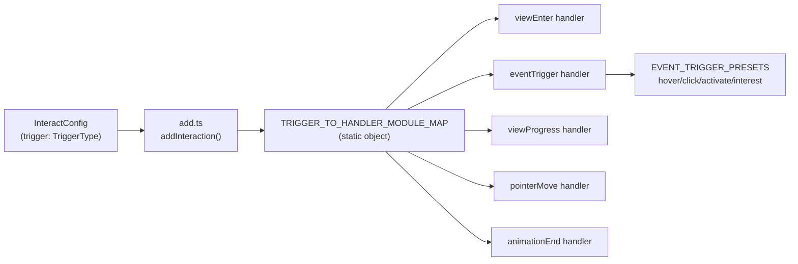
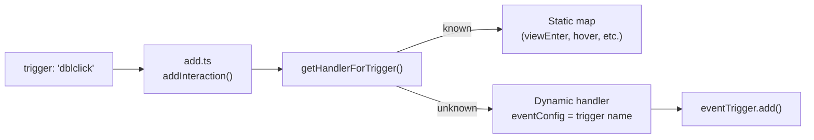

# Custom Event Triggers for Interact

## Architecture Summary

Currently, triggers flow through a static handler map:




The key insight: `hover`, `click`, `activate`, and `interest` are all thin wrappers around `eventTrigger.ts`. They just inject a preset event config (e.g., hover -> `{ enter: ['mouseenter'], leave: ['mouseleave'] }`). For custom triggers, we do the same -- the trigger name itself becomes the event config.

**After the change**, unknown trigger names will be automatically routed through `eventTrigger` using the trigger name as the DOM event:




## Part 0: Rename `StateParams` and `PointerTriggerParams`

Rename across the entire codebase:

- `StateParams` -> `StateTriggerParams`
- `PointerTriggerParams` -> `AnimationTriggerParams`

**Files affected (source):**

- `src/types.ts` -- type definitions, `EventTriggerParams`, `TriggerParams`, `InteractionParamsTypes`, `IInteractElement.toggleEffect`
- `src/handlers/index.ts` -- import and `withEventTriggerConfig` signature
- `src/handlers/eventTrigger.ts` -- import and cast usages in `addEventTriggerHandler`
- `src/handlers/effectHandlers.ts` -- import and function signatures
- `src/web/InteractElement.ts` -- import for `toggleEffect` method
- `src/core/InteractionController.ts` -- import for `toggleEffect` method

**Files affected (rules/docs):**

- `rules/full-lean.md` -- references in params documentation
- `rules/click.md` -- references to `StateParams.method`
- `docs/api/types.md` -- type documentation
- `docs/api/interaction-controller.md` -- `toggleEffect` param type
- `docs/api/README.md` -- type references

Use `replace_all` for each rename. This is a straightforward find-and-replace with no logic changes.

## Part 1: Type Changes

**File: [src/types.ts](packages/interact/src/types.ts)**

1. Open up `TriggerType` to accept any string while preserving IDE autocomplete for known types:

```typescript
export type TriggerType =
  | 'hover'
  | 'click'
  | 'viewEnter'
  | 'pageVisible'
  | 'animationEnd'
  | 'viewProgress'
  | 'pointerMove'
  | 'activate'
  | 'interest'
  | (string & {});
```

1. `TriggerParams` stays the same -- no `EventTriggerParams` added. `eventConfig` remains internal-only and is never exposed in the public config API. Custom event triggers use `StateTriggerParams | AnimationTriggerParams` (same as `click`/`hover`).
2. Add a string index signature to `InteractionParamsTypes` (line 252) so that custom trigger keys resolve properly in generics:

```typescript
export type InteractionParamsTypes = {
  hover: StateTriggerParams | AnimationTriggerParams;
  click: StateTriggerParams | AnimationTriggerParams;
  // ... existing entries ...
  [key: string]: StateTriggerParams | AnimationTriggerParams | ViewEnterParams | PointerMoveParams | AnimationEndParams;
};
```

## Part 2: Handler Resolution

**File: [src/handlers/index.ts](packages/interact/src/handlers/index.ts)**

Export a `getHandlerForTrigger(trigger)` function that:

- Returns the existing handler module for known triggers (hover, click, viewEnter, etc.)
- For unknown triggers, returns a dynamically created handler that internally injects the trigger name as `eventConfig` (the internal property) into `eventTrigger.add()`. The user never sees or provides `eventConfig` -- it is derived from the trigger name.
- All dynamic handlers share `eventTrigger.remove` for cleanup

```typescript
const KNOWN_HANDLERS = { /* existing map */ };

export function getHandlerForTrigger(trigger: string) {
  if (trigger in KNOWN_HANDLERS) {
    return KNOWN_HANDLERS[trigger as TriggerType];
  }

  return {
    add: (source, target, effect, options, interactOptions) => {
      // eventConfig is internal-only -- derived from the trigger name, never from user params
      eventTrigger.add(source, target, effect, { ...options, eventConfig: trigger }, interactOptions ?? {});
    },
    remove: eventTrigger.remove,
  };
}

export default KNOWN_HANDLERS;
```

## Part 3: Core `add.ts` Changes

**File: [src/core/add.ts](packages/interact/src/core/add.ts)**

- Import `getHandlerForTrigger` from `../handlers`
- In `addInteraction()` (line 715), replace:
`TRIGGER_TO_HANDLER_MODULE_MAP[trigger]?.add(...)` with `getHandlerForTrigger(trigger).add(...)`
- In `_processSequences()` (line 446) and `_processSequencesForTarget()` (line 536), apply the same replacement for the sequence handler dispatch

## Part 4: Core `remove.ts` -- No Changes Needed

The `removeListItems` function iterates `Object.values(TRIGGER_TO_HANDLER_MODULE_MAP)` and calls `module.remove(element)`. Since `eventTrigger.remove` is already among these values (referenced by hover, click, activate, interest), and since `eventTrigger` uses a single `WeakMap<HTMLElement, Set<HandlerObject>>` for all event-based handlers, calling `eventTrigger.remove` once cleans up ALL event handlers for that element -- including any custom triggers. No changes needed.

## Part 5: Tests

**File: [test/eventTrigger.spec.ts](packages/interact/test/eventTrigger.spec.ts)** (new)

Add tests covering:

- Custom trigger name (e.g., `trigger: 'dblclick'`) routes through `eventTrigger` and attaches the correct DOM listener
- Custom trigger with `toggle` mode (StateTriggerParams `method: 'toggle'`)
- Custom trigger with `once` mode (AnimationTriggerParams `type: 'once'`)
- Cleanup of custom trigger handlers via `remove()`
- Existing built-in triggers still work as before (regression)

Use the same mock patterns from existing tests (mock `@wix/motion`, create DOM elements, test event dispatch).

## Part 6: Demo Playground

**File: [apps/demo/src/react/components/CustomEventDemo.tsx](apps/demo/src/react/components/CustomEventDemo.tsx)** (new)

Create a demo component showcasing custom event triggers:

- A text input that responds to `input` event with a pulse animation
- A card that responds to `dblclick` with a flip animation
- A card that responds to `contextmenu` (right-click) with a shake animation
- Controls to switch between different custom event types
- Follow the same pattern as `Playground.tsx`: `useMemo` for config, `useInteractInstance(config)`, `<Interaction>` components

**File: [apps/demo/src/react/App.tsx](apps/demo/src/react/App.tsx)**

- Import and add `<CustomEventDemo />` to the page layout

## Part 7: Rules Update

**File: [rules/custom-event.md](packages/interact/rules/custom-event.md)** (new)

Add a succinct rule file for custom event triggers:

- Explain that any DOM event name can be used as a trigger
- Show the basic pattern: `trigger: 'dblclick'` with `StateTriggerParams` or `AnimationTriggerParams` (same params as click/hover)
- 2-3 concise examples

**File: [rules/full-lean.md](packages/interact/rules/full-lean.md)**

- Update the `trigger: TriggerType` section to mention that any DOM event name is accepted as a custom trigger
- Note that custom triggers use the same params as click/hover (`StateTriggerParams | AnimationTriggerParams`)

## Part 8: Docs Update

**File: [docs/guides/understanding-triggers.md](packages/interact/docs/guides/understanding-triggers.md)**

- Add a new section "Custom Event Triggers" explaining arbitrary DOM events as triggers
- Update the trigger overview table to include custom event triggers
- Add examples for `dblclick`, `input`, `contextmenu` using `StateTriggerParams`/`AnimationTriggerParams`

**File: [docs/api/types.md](packages/interact/docs/api/types.md)**

- Update `TriggerType` documentation to reflect it now accepts any string
- Note that custom triggers accept `StateTriggerParams | AnimationTriggerParams` (same as click/hover)

