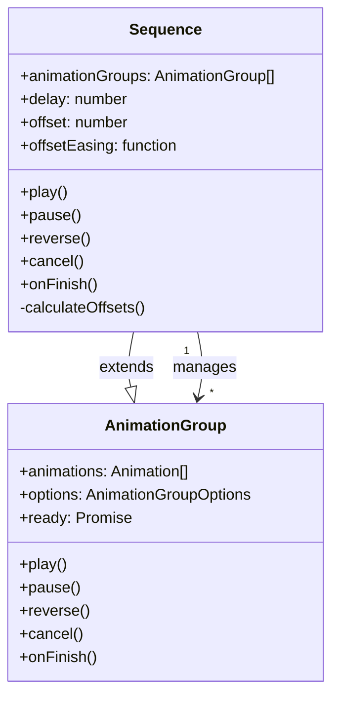

# Sequence Feature Implementation

This plan implements the Sequence feature as specified in [sequences-spec.md](packages/interact/dev/sequences-spec.md). The feature enables managing multiple Effects as a coordinated timeline with staggered delays.

## Architecture Overview



## Part 1: @wix/motion Package Changes

### 1.1 Create Sequence Class

Create new file `packages/motion/src/Sequence.ts`:

- Extend `AnimationGroup` to inherit the playback control API
- Store `animationGroups: AnimationGroup[]` instead of `animations: Animation[]`
- Add properties: `delay`, `offset`, `offsetEasing`
- Implement `calculateOffsets()` method using the formula from spec:
```typescript
const last = indices.at(-1);
indices.map((n) => (easing(n / last) * last * offset) | 0);
```

- Override playback methods (`play`, `pause`, `reverse`, `cancel`) to delegate to child `AnimationGroup` instances
- Apply calculated delay offsets to each effect's animation timing

### 1.2 Add Sequence Types

Update `packages/motion/src/types.ts`:

```typescript
export type SequenceOptions = {
  delay?: number; // default 0
  offset?: number; // default 100
  offsetEasing?: string | ((p: number) => number);
};
```

### 1.3 Export Sequence

Update `packages/motion/src/index.ts` to export:

- `Sequence` class
- `SequenceOptions` type

## Part 2: @wix/interact Package Changes

### 2.1 Update Types

Update `packages/interact/src/types.ts`:

```typescript
// New Sequence type
export type Sequence = {
  sequenceId: string; // for referencing reusable sequences
  delay?: number; // default 0
  offset?: number; // default 100
  offsetEasing?: string | ((p: number) => number); // default linear
  effects: (Effect | EffectRef)[];
};

// Update InteractConfig
export type InteractConfig = {
  effects: Record<string, Effect>;
  sequences?: Record<string, Sequence>; // NEW: reusable sequences
  conditions?: Record<string, Condition>;
  interactions: Interaction[];
};

// Update Interaction
export type Interaction = InteractionTrigger & {
  effects: ((Effect | EffectRef) & { interactionId?: string })[];
  sequences?: Sequence[]; // NEW: inline sequences
};
```

### 2.2 Update InteractCache

Add sequences to the cache structure in `packages/interact/src/types.ts`:

```typescript
export type InteractCache = {
  effects: { [effectId: string]: Effect };
  sequences: { [sequenceId: string]: Sequence }; // NEW
  conditions: { [conditionId: string]: Condition };
  interactions: {
    /* existing structure */
  };
};
```

### 2.3 Update parseConfig Function

Modify `packages/interact/src/core/Interact.ts`:

1. Parse `config.sequences` into cache (similar to `config.effects`)
2. Process `interaction.sequences` array:

   - Resolve `sequenceId` references from `config.sequences`
   - Process each effect within the sequence
   - Generate unique IDs for sequence effects

3. Track sequence membership for effects (needed for delay calculation)

### 2.4 Update Effect Processing in add.ts

Modify `packages/interact/src/core/add.ts`:

1. When adding interactions, check if effects belong to a sequence
2. Create `Sequence` instance from `@wix/motion` for grouped effects
3. Apply calculated delay offsets based on effect index in sequence
4. Handle sequence removal (when conditions change or elements removed)

### 2.5 Handler Integration

Update relevant trigger handlers (e.g., `viewEnter.ts`, `click.ts`) to:

- Accept `Sequence` instances in addition to individual `AnimationGroup`
- Properly manage sequence lifecycle (play, pause, cancel)

## Part 3: Offset Calculation Implementation

The offset calculation follows this algorithm:

```typescript
function calculateOffsets(
  count: number,
  offset: number,
  easingFn: (t: number) => number,
): number[] {
  if (count <= 1) return [0];

  const last = count - 1;
  return Array.from({ length: count }, (_, i) => (easingFn(i / last) * last * offset) | 0);
}
```

The calculated offsets are added to each effect's existing `delay` property.

## Key Implementation Notes

1. **Initial Scope**: Only `keyframeEffect` and `namedEffect` types (not `customEffect`)
2. **Skip `align` Property**: Per spec, do not implement the `align` property yet
3. **Effect Removal**: When an effect is removed (e.g., condition no longer matches), recalculate delays for remaining effects
4. **Sequence Removal**: Optimize to avoid recalculating when entire sequence is removed
5. **No Element Target**: `Sequence` has no `key` property - targeting is per-effect

## Testing Strategy

1. Unit tests for `Sequence` class offset calculations
2. Unit tests for easing function integration
3. Integration tests for sequence parsing in Interact
4. E2E tests for staggered animations with various easing functions