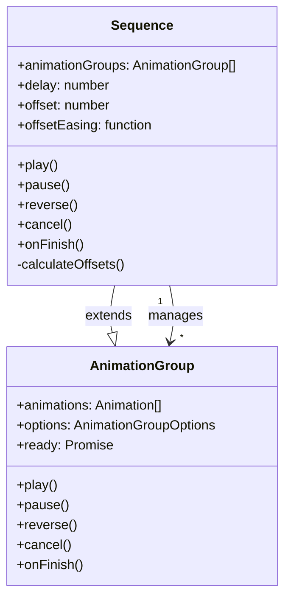

# Sequence Feature Implementation

This plan implements the Sequence feature as specified in [sequences-spec.md](packages/interact/dev/sequences-spec.md). The feature enables managing multiple Effects as a coordinated timeline with staggered delays.

## Architecture Overview




## Part 1: @wix/motion Package Changes

### 1.1 Create Sequence Class

Create new file `packages/motion/src/Sequence.ts`:

- Extend `AnimationGroup` to inherit the playback control API
- Store `animations: AnimationGroup[]` instead of `animations: Animation[]`
- Add properties: `delay`, `offset`, `offsetEasing`
- Implement `calculateOffsets()` method using the formula from spec:

```typescript
const last = indices.at(-1);
indices.map((n) => (easing(n / last) * last * offset) | 0);
```

- Override playback methods/properties where needed to delegate to child `AnimationGroup` instances
- Apply calculated delay offsets to each effect's animation timing

### 1.2 Add Sequence Types

Update `packages/motion/src/types.ts`:

```typescript
export type SequenceOptions = {
  delay?: number; // default 0
  offset?: number; // default 0
  offsetEasing?: string | ((p: number) => number);
};
```

### 1.3 Export Sequence

Update `packages/motion/src/index.ts` to export:

- `Sequence` class
- `SequenceOptions` type

### 1.4 Implement a `getSequence()`

- Create this function in `packages/motion/src/motion.ts`
- Export it via `packages/motion/src/index.ts`
- It should have the following signature:

```ts
type AnimationGroupArgs = {
  target: HTMLElement | HTMLElement[] | string | null;
  options: AnimationOptions;
  context?: Record<string, any>;
};

type getSequence = (
  options: SequenceOptions,
  animations: AnimationGroupArgs | AnimationGroupArgs[],
) => Sequence;
```

The `getSequence()` funciton has 2 flows:

- If passed `animations: AnimationGroupArgs` it creates a `Sequence` from a single effect definition applied to multiple targets.
- If passed `animations: AnimationGroupArgs[]` it creates a `Sequence` from a each effect definition in the array.

## Part 2: @wix/interact Package Changes

### 2.1 Update Types

Update `packages/interact/src/types.ts`:

```typescript
// New SequenceOptions type
export type SequenceOptionsConfig = {
  delay?: number; // default 0
  offset?: number; // default 0
  offsetEasing?: string | ((p: number) => number); // default linear
  sequenceId?: string; // for referencing a reusable sequence declaration
};

// New SequenceConfig type
export type SequenceConfig = SequenceOptionsConfig &
  (
    | {
        effect: Effect | EffectRef;
      }
    | {
        effects: (Effect | EffectRef)[];
      }
  );

// New SequenceConfigRef type
export type SequenceConfigRef = {
  sequenceId: string;
} & {
  delay?: number; // default 0
  offset?: number; // default 0
  offsetEasing?: string | ((p: number) => number); // default linear
};

// Update InteractConfig
export type InteractConfig = {
  effects: Record<string, Effect>;
  sequences?: Record<string, SequenceConfig>; // NEW: reusable sequences
  conditions?: Record<string, Condition>;
  interactions: Interaction[];
};

// Update Interaction - use mutually exclusive branches for proper type narrowing
export type Interaction = InteractionTrigger &
  (
    | {
        effects: ((Effect | EffectRef) & { interactionId?: string })[];
        sequences?: never; // effects-only: explicitly exclude sequences
      }
    | {
        effects?: never; // sequences-only: explicitly exclude effects
        sequences: (SequenceConfig | SequenceConfigRef)[];
      }
    | {
        effects: ((Effect | EffectRef) & { interactionId?: string })[];
        sequences: (SequenceConfig | SequenceConfigRef)[];
      }
  );
```

### 2.2 Update InteractCache

Add sequences to the cache structure in `packages/interact/src/types.ts`:

```typescript
export type InteractCache = {
  effects: { [effectId: string]: Effect };
  sequences: { [sequenceId: string]: SequenceConfig }; // NEW
  conditions: { [conditionId: string]: Condition };
  interactions: {
    [path: string]: {
      triggers: Interaction[];
      effects: Record<string, (InteractionTrigger & { effect: Effect | EffectRef })[]>;
      sequences: Record<string, (InteractionTrigger & { sequence: SequenceConfig })[]>;
      interactionIds: Set<string>;
      selectors: Set<string>;
    };
  };
};
```

### 2.3 Update parseConfig Function

Modify `packages/interact/src/core/Interact.ts`:

1. Parse `config.sequences` into cache (similar to `config.effects`)
2. Process `interaction.sequences` array:

- Resolve `sequenceId` references from `config.sequences`
- Process each effect within the sequence:
  - Either as list of multiple effects as `effects: Effect[]`
  - Or a single `effect: Effect` declaration, generating a list of effects on multiple target elements
- Generate unique IDs for sequence effects

1. Track sequence membership for effects (needed for delay calculation)

### 2.4 Update Effect Processing in `add.ts`

Modify `packages/interact/src/core/add.ts`:

1. When adding interactions, check if effects belong to a sequence
2. Create `Sequence` instance from `@wix/motion` for grouped effects
3. Apply calculated delay offsets based on effect index in sequence
4. Handle sequence removal (when conditions change or elements removed)

### 2.5 Create `Sequence` caching:

- Cache created `Sequence` instances on a static property `Interact.sequenceCache`
- Add endpoint on `Interact` class to get cached `Sequence` instances
- Add a new endpoint on `Interact.getEffect()` class that wraps `getAnimation()` and `getSequence()` of `@wix/motion` and, depending on the provided arguments, either:
  - Returns a cached `Sequence` if there's one, or
  - Creates a new `Sequence`, or
  - Returns an `AnimationGroup`

### 2.6 Handler Integration

Update relevant trigger handlers (e.g., `viewEnter.ts`, `click.ts`) to:

- Accept `Sequence` instances in addition to individual `AnimationGroup`
- Properly manage sequence playback (play, pause, cancel)

## Part 3: Offset Calculation Implementation

The offset calculation follows this algorithm:

```typescript
function calculateOffsets(
  count: number,
  offset: number,
  easingFn: (t: number) => number,
): number[] {
  if (count <= 1) return [0];

  const last = count - 1;
  return Array.from({ length: count }, (_, i) => (easingFn(i / last) * last * offset) | 0);
}
```

The calculated offsets are added to each effect's existing `delay` property.

## Key Implementation Notes

1. **Initial Scope**: Only `keyframeEffect` and `namedEffect` types (not `customEffect`)
2. **Skip `align` Property**: Per spec, do not implement the `align` property yet
3. **Effect Removal**: When an effect is removed (e.g., condition no longer matches), recalculate delays for remaining effects
4. **Sequence Removal**: Optimize to avoid recalculating when entire sequence is removed
5. **No Element Target**: `Sequence` has no `key` property - targeting is per-effect

## Testing Strategy

1. Unit tests for `Sequence` class offset calculations
2. Unit tests for easing function integration
3. Integration tests for sequence parsing in Interact
4. E2E tests for staggered animations with various easing functions

