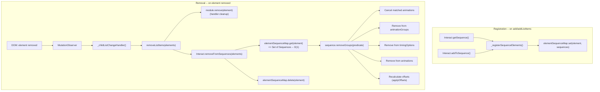

# Sequence `removeGroups` Implementation Plan

## Problem

When list items are removed from the DOM (via `removeListItems` or the MutationObserver in `_childListChangeHandler`), the trigger handler cleanup runs (`module.remove(element)`) but the cached `Sequence` objects still hold `AnimationGroup` instances targeting the removed elements. This means:

- Stagger offset calculations remain based on stale groups
- Playback iterates over dead animations (targeting detached elements)
- Memory leaks from retaining references to removed DOM nodes

## Design

### Layer 1: Motion package -- `Sequence.removeGroups()`

Add a `removeGroups` method to the `Sequence` class (mirror of `addGroups`) that:

1. Accepts a predicate function to identify groups to remove
2. Removes matching groups from `this.animationGroups`, `this.timingOptions`, and `this.animations`
3. Cancels removed animations before removal
4. Recalculates offsets via `this.applyOffsets()` for remaining groups
5. Resets `this.ready` promise
6. Returns the removed groups (useful for testing and for the caller to do further cleanup)

API:

```typescript
removeGroups(predicate: (group: AnimationGroup) => boolean): AnimationGroup[]
```

This allows the Interact layer to match groups by reference (looked up from the WeakMap cache).

### Layer 2: Interact package -- `elementSequenceMap` WeakMap + `removeFromSequences`

#### The Problem with Brute-Force Iteration

A naive approach would iterate `sequenceCache.values()` then each sequence's `animationGroups` then each group's `animations` to find the target element. This is O(sequences x groups x animations) on every removal -- too expensive.

#### Solution: `elementSequenceMap` WeakMap

Add a `WeakMap<HTMLElement, Set<Sequence>>` on the `Interact` class that provides O(1) lookup from a target element to the set of Sequences containing it.

```typescript
static elementSequenceMap = new WeakMap<HTMLElement, Set<Sequence>>();
```

**Why `WeakMap`**: Keys are `HTMLElement` references. When an element is removed from the DOM and all JS references to it are released, the WeakMap entry is automatically garbage-collected. No manual cleanup needed for GC purposes.

**Why `Set<Sequence>`**: A single element could theoretically appear in multiple Sequences (e.g. if the same element participates in different interaction sequences). Using a Set avoids duplicates and allows efficient deletion.

#### Population: When Sequences are Created or Extended

Both `Interact.getSequence()` and `Interact.addToSequence()` call into `@wix/motion` to create `AnimationGroup` instances. After creation, these methods already know the resulting `Sequence` and can derive the target elements from `animationGroupArgs[].target`. We populate the map at these two sites:

In **`Interact.getSequence()`** -- after creating the Sequence, register all target elements:

```typescript
static getSequence(cacheKey, sequenceOptions, animationGroupArgs, context): Sequence {
  const cached = Interact.sequenceCache.get(cacheKey);
  if (cached) return cached;

  const sequence = getMotionSequence(sequenceOptions, animationGroupArgs, context);
  Interact.sequenceCache.set(cacheKey, sequence);

  // Populate element -> Sequence lookup
  Interact._registerSequenceElements(animationGroupArgs, sequence);

  return sequence;
}
```

In **`Interact.addToSequence()`** -- after adding groups to an existing Sequence:

```typescript
static addToSequence(cacheKey, animationGroupArgs, indices, context): boolean {
  const cached = Interact.sequenceCache.get(cacheKey);
  if (!cached) return false;

  const newGroups = createAnimationGroups(animationGroupArgs, context);
  // ... existing addGroups logic ...
  cached.addGroups(entries);

  // Populate element -> Sequence lookup for new elements
  Interact._registerSequenceElements(animationGroupArgs, cached);

  return true;
}
```

The shared helper resolves elements from `AnimationGroupArgs.target`:

```typescript
private static _registerSequenceElements(
  animationGroupArgs: AnimationGroupArgs[],
  sequence: Sequence,
): void {
  for (const { target } of animationGroupArgs) {
    const elements = Array.isArray(target) ? target
      : target instanceof HTMLElement ? [target]
      : [];
    for (const el of elements) {
      let seqs = Interact.elementSequenceMap.get(el);
      if (!seqs) {
        seqs = new Set();
        Interact.elementSequenceMap.set(el, seqs);
      }
      seqs.add(sequence);
    }
  }
}
```

#### Removal: `Interact.removeFromSequences(elements)`

When elements are removed, the lookup is O(elements) instead of O(sequences x groups x animations):

```typescript
static removeFromSequences(elements: HTMLElement[]): void {
  for (const element of elements) {
    const sequences = Interact.elementSequenceMap.get(element);
    if (!sequences) continue;

    for (const sequence of sequences) {
      sequence.removeGroups((group) =>
        group.animations.some(
          (a) => (a.effect as KeyframeEffect)?.target === element,
        ),
      );
    }

    Interact.elementSequenceMap.delete(element);
  }
}
```

This is called from `removeListItems` in [packages/interact/src/core/remove.ts](packages/interact/src/core/remove.ts):

```typescript
export function removeListItems(elements: HTMLElement[]) {
  const modules = Object.values(TRIGGER_TO_HANDLER_MODULE_MAP);
  for (const element of elements) {
    for (const module of modules) {
      module.remove(element);
    }
  }
  Interact.removeFromSequences(elements);
}
```

#### Cleanup on `Interact.destroy()`

`Interact.destroy()` already clears `sequenceCache`. Since `elementSequenceMap` is a `WeakMap`, it does not need explicit clearing (its entries are GC'd when elements are collected). However, for consistency and to avoid stale `Set<Sequence>` references during the same session, we replace it:

```typescript
static destroy(): void {
  // ... existing cleanup ...
  Interact.sequenceCache.clear();
  Interact.elementSequenceMap = new WeakMap();
}
```

## File Changes

### [packages/motion/src/Sequence.ts](packages/motion/src/Sequence.ts)

Add `removeGroups(predicate)` method:

- Iterate `animationGroups` and partition into keep/remove based on predicate
- Cancel animations in removed groups
- Rebuild `animationGroups`, `timingOptions`, and `animations` arrays (keeping order)
- Call `applyOffsets()` and reset `ready`
- Return removed groups array

### [packages/interact/src/core/Interact.ts](packages/interact/src/core/Interact.ts)

- Add `static elementSequenceMap = new WeakMap<HTMLElement, Set<Sequence>>()`
- Add `private static _registerSequenceElements(args, sequence)` helper
- Modify `static getSequence()` -- call `_registerSequenceElements` after creating the Sequence
- Modify `static addToSequence()` -- call `_registerSequenceElements` after adding groups
- Add `static removeFromSequences(elements: HTMLElement[])` -- look up and remove via WeakMap
- Modify `static destroy()` -- reset `elementSequenceMap`

### [packages/interact/src/core/remove.ts](packages/interact/src/core/remove.ts)

- Call `Interact.removeFromSequences(elements)` at the end of `removeListItems`

## Test-First Approach

### Motion tests -- [packages/motion/test/Sequence.spec.ts](packages/motion/test/Sequence.spec.ts)

New `describe('removeGroups')` section:

- **removes groups matching predicate** -- verify `animationGroups` array shrinks
- **removes corresponding entries from animations array** -- verify flattened `animations` updated
- **removes corresponding entries from timingOptions** -- verify via subsequent `addGroups` still working correctly
- **cancels animations in removed groups** -- verify `cancel()` called on removed group's animations
- **recalculates offsets after removal** -- verify delays/endDelays recomputed for remaining groups
- **updates ready promise after removal** -- verify new `ready` resolves
- **returns removed groups** -- verify return value contains the removed AnimationGroup instances
- **no-op when predicate matches nothing** -- verify arrays unchanged
- **handles removing all groups (empty sequence)** -- verify graceful empty state
- **handles removing from single-group sequence** -- verify offset edge case (single -> empty)

### Interact tests -- [packages/interact/test/sequences.spec.ts](packages/interact/test/sequences.spec.ts)

New suite (Suite H or extend Suite D/E):

- **elementSequenceMap is populated when Sequence is created via getSequence** -- verify WeakMap has entries for target elements
- **elementSequenceMap is populated when groups are added via addToSequence** -- verify new elements are registered
- **removeFromSequences calls removeGroups on the correct Sequence** -- verify mock `removeGroups` called
- **removeFromSequences deletes element from elementSequenceMap** -- verify WeakMap entry removed
- **removeListItems triggers removeFromSequences for removed elements** -- verify integration
- **removeFromSequences is a no-op for elements not in any Sequence** -- verify no errors
- **elementSequenceMap is reset on Interact.destroy()** -- verify clean state
- **MutationObserver removal triggers removeGroups on Sequence** -- verify end-to-end flow

## Data Flow



